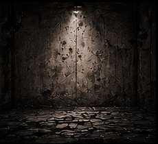
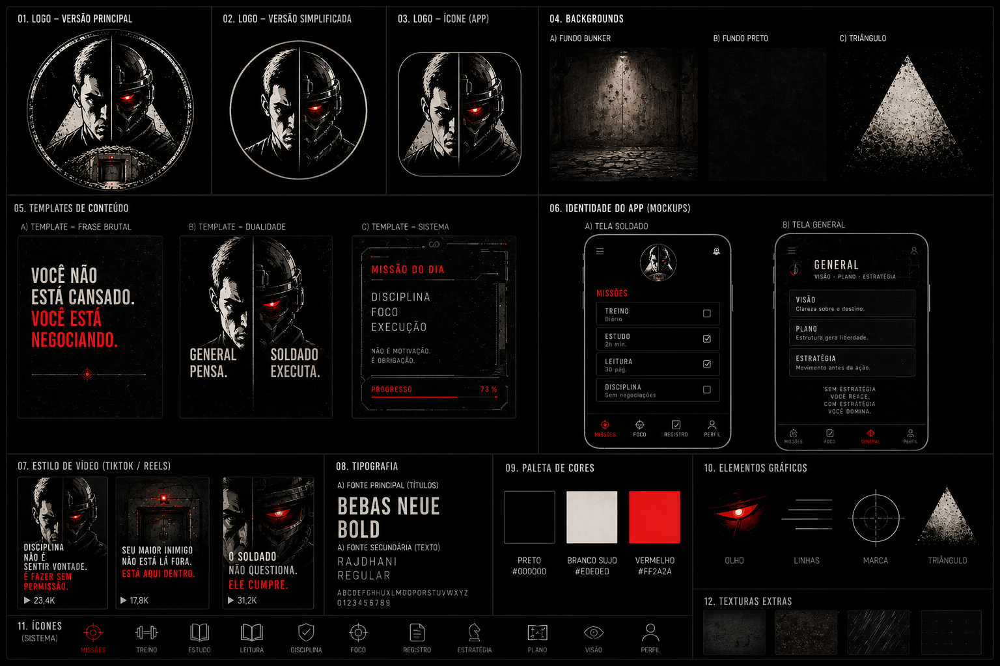
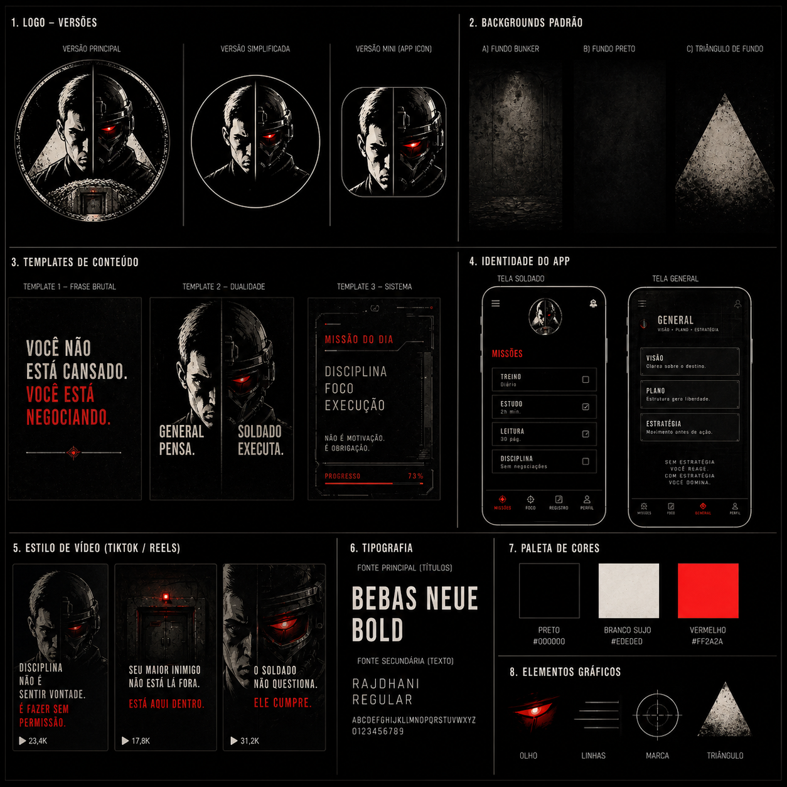
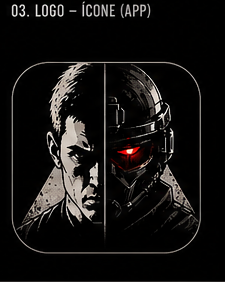
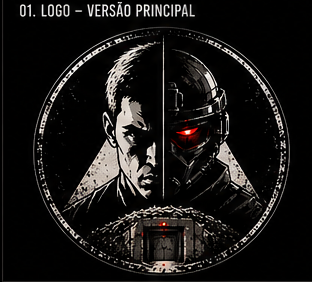
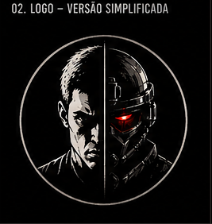
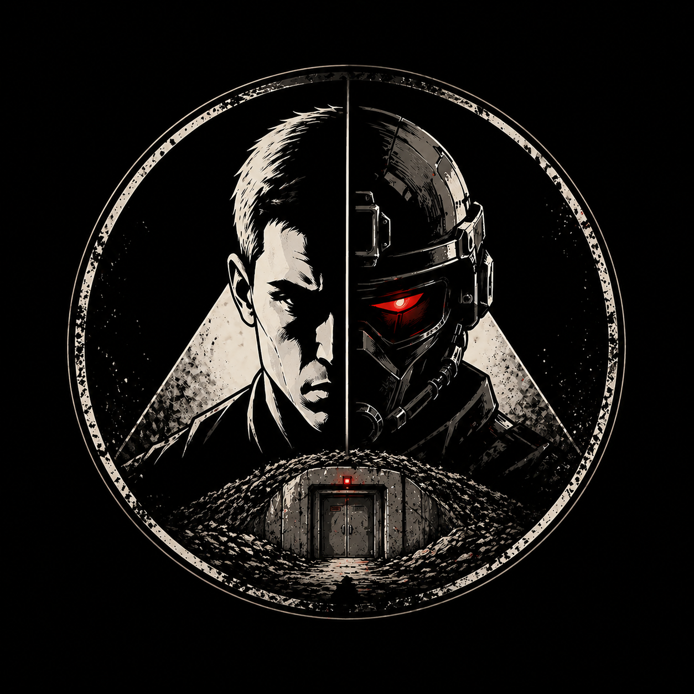

# Auditoria de assets para o General

Data: 2026-05-09

## Decisão visual

Os assets existentes foram inspecionados como imagens, não apenas listados. A família visual atual é forte, escura e agressiva, com muito preto, vermelho e figura híbrida General/Soldado. Isso funciona como marca e como referência de tensão, mas não deve dominar a tela do General, porque reforça o brutalismo do Soldado.

A tela do General deve usar:

- os fundos pequenos já importados em `mobile/src/assets/bunkermode/backgrounds/`.
- `docs/design-references/bunkermode/bg_bunker_reference.png` apenas como referência visual, fora do bundle do app.
- Os boards de marca apenas como inspiração de composição: linhas de mapa, moldura técnica e eixo central.
- Logos/personagens descartados para fundo, porque são pesados, agressivos ou contêm texto de referência.
- O símbolo oficial usado em runtime foi reduzido para 512 x 512 em mobile e web; a versão 2048 x 2048 fica preservada em `docs/design-references/bunkermode/logo_final_selected.png`.

## Imagens encontradas

| Asset | Dimensões | Tamanho | Tipo | Uso decidido |
| --- | ---: | ---: | --- | --- |
| `docs/design-references/bunkermode/bg_bunker_reference.png` | 230 x 210 | 88K | PNG RGB | Referência de textura discreta. Fora do runtime. |
| `docs/design-references/bunkermode/brand_board_full_reference.png` | 1536 x 1024 | 1.7M | PNG RGB | Inspiração visual. Grande e carregado demais para fundo mobile. |
| `docs/design-references/bunkermode/brand_identity_board_v1.png` | 1254 x 1254 | 1.6M | PNG RGB | Inspiração visual. Muito preto/vermelho para o General. |
| `docs/design-references/bunkermode/app_icon_reference.png` | 225 x 282 | 64K | PNG RGB | Descartado. Contém texto de referência e personagem agressivo. |
| `docs/design-references/bunkermode/logo_main_reference.png` | 312 x 282 | 112K | PNG RGB | Descartado para UI principal. Contém texto de referência. |
| `docs/design-references/bunkermode/logo_simple_reference.png` | 267 x 282 | 76K | PNG RGB | Descartado para fundo. Personagem/olho vermelho puxa para execução. |
| `docs/design-references/bunkermode/logo_final_selected.png` | 2048 x 2048 | 4.0M | PNG RGBA | Fonte visual preservada. Não importar no runtime. |
| `docs/design-references/bunkermode/logo_no_arrow_bunker_reference.png` | 1254 x 1254 | 1.4M | PNG RGB | Descartado para fundo. Forte demais e centrado no personagem. |

## Folha de contato

| Fundo | Marca | Templates |
| --- | --- | --- |
|  |  |  |

| Logo app | Logo principal | Logo simples |
| --- | --- | --- |
|  |  |  |

| Logo final | Logo sem seta |
| --- | --- |
|  |  |
